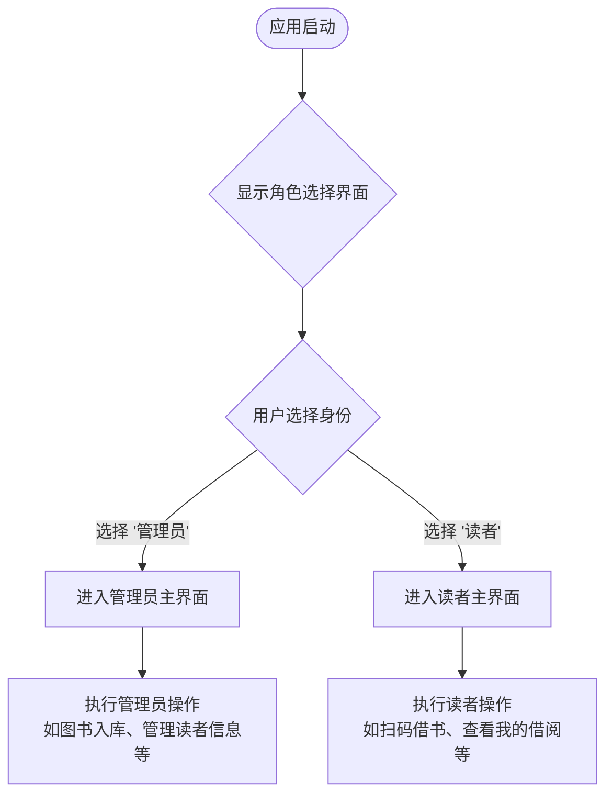

```mermaid
graph TD
    A([应用启动]) --> B{显示角色选择界面};
    B --> C{"用户选择身份"};
    C -- "选择 '管理员'" --> D[进入管理员主界面];
    C -- "选择 '读者'" --> E[进入读者主界面];
    
    D --> F[执行管理员操作<br>如图书入库、管理读者信息等];
    E --> G[执行读者操作<br>如扫码借书、查看我的借阅等];
```