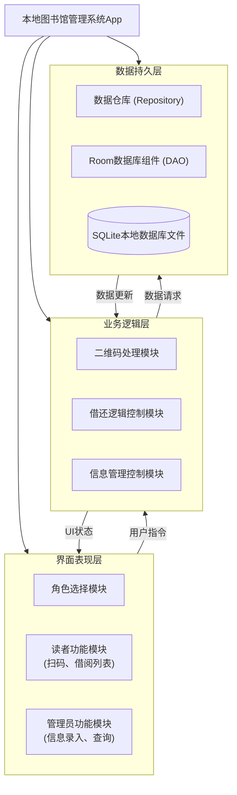

```mermaid
graph TD
    A["本地图书馆管理系统App"] --> B["界面表现层"];
    A --> C["业务逻辑层"];
    A --> D["数据持久层"];

    subgraph B ["界面表现层"]
        B1["角色选择模块"]
        B2["读者功能模块<br>(扫码、借阅列表)"]
        B3["管理员功能模块<br>(信息录入、查询)"]
    end

    subgraph C ["业务逻辑层"]
        C1["二维码处理模块"]
        C2["借还逻辑控制模块"]
        C3["信息管理控制模块"]
    end

    subgraph D ["数据持久层"]
        D1["数据仓库 (Repository)"]
        D2["Room数据库组件 (DAO)"]
        D3[("SQLite本地数据库文件")]
    end
    
    B -- "用户指令" --> C;
    C -- "数据请求" --> D;
    D -- "数据更新" --> C;
    C -- "UI状态" --> B;
```