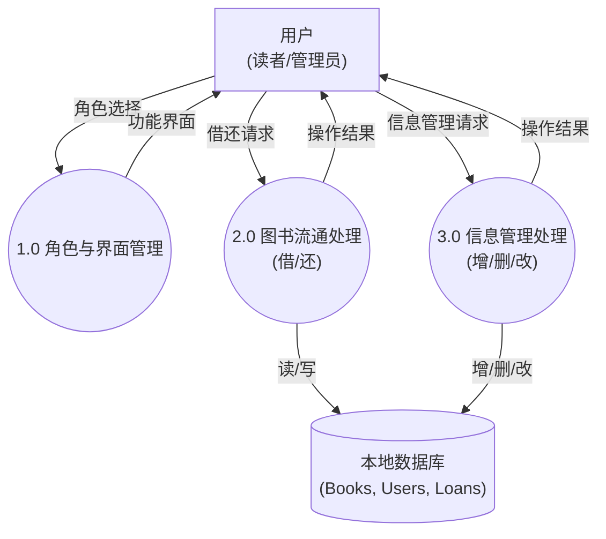

```mermaid
graph TD
    %% 定义参与者
    User["用户<br>(读者/管理员)"]

    %% 定义处理过程
    P1(("1.0 角色与界面管理"))
    P2(("2.0 图书流通处理<br>(借/还)"))
    P3(("3.0 信息管理处理<br>(增/删/改)"))

    %% 定义数据存储
    DS_DB[("本地数据库<br>(Books, Users, Loans)")]

    %% 定义数据流
    User -- "角色选择" --> P1
    P1 -- "功能界面" --> User
    
    User -- "借还请求" --> P2
    P2 -- "读/写" --> DS_DB
    P2 -- "操作结果" --> User

    User -- "信息管理请求" --> P3
    P3 -- "增/删/改" --> DS_DB
    P3 -- "操作结果" --> User
```