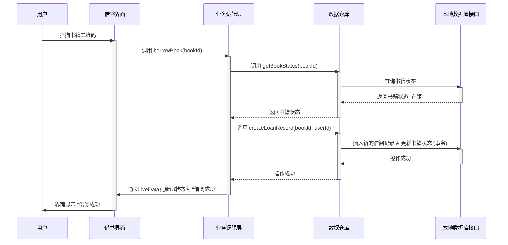

```mermaid
sequenceDiagram
    participant User as 用户
    participant BorrowActivity as 借书界面
    participant BookViewModel as 业务逻辑层
    participant Repository as 数据仓库
    participant RoomDAO as 本地数据库接口

    User->>BorrowActivity: 扫描书籍二维码
    activate BorrowActivity
    BorrowActivity->>BookViewModel: 调用 borrowBook(bookId)
    activate BookViewModel
    
    BookViewModel->>Repository: 调用 getBookStatus(bookId)
    activate Repository
    Repository->>RoomDAO: 查询书籍状态
    activate RoomDAO
    RoomDAO-->>Repository: 返回书籍状态 "在馆"
    deactivate RoomDAO
    Repository-->>BookViewModel: 返回书籍状态
    deactivate Repository
    
    BookViewModel->>Repository: 调用 createLoanRecord(bookId, userId)
    activate Repository
    Repository->>RoomDAO: 插入新的借阅记录 & 更新书籍状态 (事务)
    activate RoomDAO
    RoomDAO-->>Repository: 操作成功
    deactivate RoomDAO
    Repository-->>BookViewModel: 操作成功
    deactivate Repository
    
    BookViewModel->>BorrowActivity: 通过LiveData更新UI状态为 "借阅成功"
    deactivate BookViewModel
    
    BorrowActivity->>User: 界面显示 "借阅成功"
    deactivate BorrowActivity
```