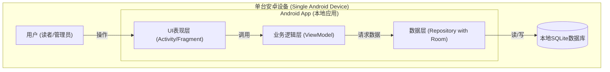

```mermaid
graph TD
    subgraph device["单台安卓设备 (Single Android Device)"]
        A["用户 (读者/管理员)"]
        
        subgraph app["Android App (本地应用)"]
            B["UI表现层 (Activity/Fragment)"]
            C["业务逻辑层 (ViewModel)"]
            D["数据层 (Repository with Room)"]
            B -- 调用 --> C
            C -- 请求数据 --> D
        end

        E[(本地SQLite数据库)]

        A -- 操作 --> B
        D -- 读/写 --> E
    end
```