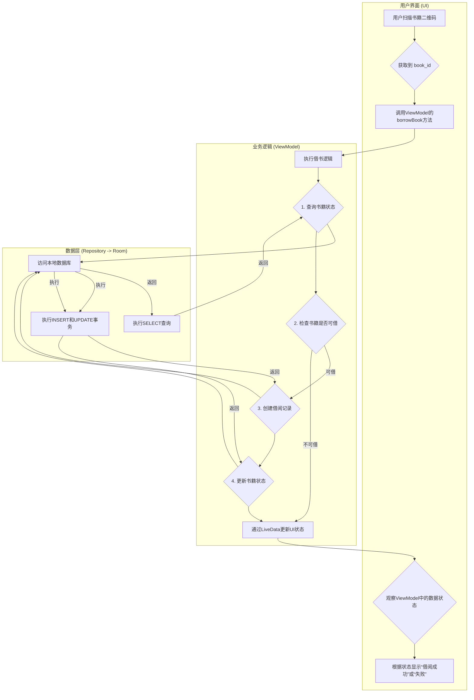

```mermaid
graph TD
    subgraph "用户界面 (UI)"
        A["用户扫描书籍二维码"]
        B{"获取到 book_id"}
        C["调用ViewModel的borrowBook方法"]
        E{"观察ViewModel中的数据状态"}
        F["根据状态显示“借阅成功”或“失败”"]
    end
    
    subgraph "业务逻辑 (ViewModel)"
        D["执行借书逻辑"]
        D1{"1. 查询书籍状态"}
        D2{"2. 检查书籍是否可借"}
        D3{"3. 创建借阅记录"}
        D4{"4. 更新书籍状态"}
        D5["通过LiveData更新UI状态"]
    end

    subgraph "数据层 (Repository -> Room)"
        H["访问本地数据库"]
        H1["执行SELECT查询"]
        H2["执行INSERT和UPDATE事务"]
    end
    
    A --> B --> C --> D
    D --> D1 --> H --"返回"--> H1 --"返回"--> D1
    D1 --> D2
    D2 --"可借"--> D3 --> H --"执行"--> H2 --"返回"--> D3
    D3 --> D4 --> H --"执行"--> H2 --"返回"--> D4
    D4 --> D5
    D5 --> E --> F
    D2 --"不可借"--> D5
```